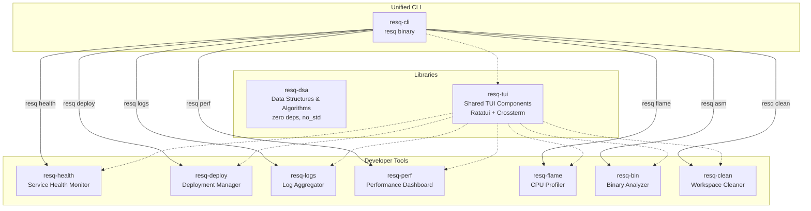

# ResQ Crates

[](https://github.com/resq-software/crates/actions)
[](https://crates.io/crates/resq-dsa)
[](https://crates.io/crates/resq-cli)
[](https://crates.io/crates/resq-tui)
[](LICENSE)

> A comprehensive Rust CLI/TUI toolset and DSA library for the ResQ autonomous drone platform.

## Overview

This monorepo contains 10 published Rust crates: a zero-dependency data structures library, a unified CLI entry point, a shared TUI component library, and 7 specialized developer tools. Every TUI tool shares a common look and feel via `resq-tui`, and all tools are accessible through the unified `resq` CLI.

## Architecture



## Packages

| Crate | Description | crates.io |
| :--- | :--- | :--- |
| [`resq-dsa`](crates/resq-dsa/) | Data structures and algorithms -- zero dependencies, `no_std` | [](https://crates.io/crates/resq-dsa) |
| [`resq-cli`](crates/resq-cli/) | Unified CLI entry point (`resq` binary) | [](https://crates.io/crates/resq-cli) |
| [`resq-tui`](crates/resq-tui/) | Shared Ratatui component library for all TUI tools | [](https://crates.io/crates/resq-tui) |
| [`resq-health`](crates/resq-health/) | Service health monitoring dashboard | [](https://crates.io/crates/resq-health) |
| [`resq-deploy`](crates/resq-deploy/) | Kubernetes and Docker Compose deployment TUI | [](https://crates.io/crates/resq-deploy) |
| [`resq-logs`](crates/resq-logs/) | Log aggregator and stream viewer | [](https://crates.io/crates/resq-logs) |
| [`resq-perf`](crates/resq-perf/) | Performance monitoring dashboard | [](https://crates.io/crates/resq-perf) |
| [`resq-flame`](crates/resq-flame/) | CPU profiler and flame graph generator | [](https://crates.io/crates/resq-flame) |
| [`resq-bin`](crates/resq-bin/) | Machine code and binary analyzer | [](https://crates.io/crates/resq-bin) |
| [`resq-clean`](crates/resq-clean/) | Interactive workspace cleaner | [](https://crates.io/crates/resq-clean) |

---

## Quick Start

```sh
cargo install resq-cli
resq help
```

## CLI Commands

All tools are accessible through the unified `resq` binary, or can be installed and run independently.

| Command | Tool | Description |
| :--- | :--- | :--- |
| `resq audit` | resq-cli | Security audit (OSV/dependency scanning) |
| `resq health` | resq-health | Service health monitoring dashboard |
| `resq deploy` | resq-deploy | Kubernetes/Docker Compose deployment TUI |
| `resq logs` | resq-logs | Aggregate and stream service logs |
| `resq perf` | resq-perf | Real-time performance metrics |
| `resq flame` | resq-flame | CPU profiling and flame graph generation |
| `resq asm` | resq-bin | Binary/machine code analysis |
| `resq clean` | resq-clean | Interactive workspace cleaner |
| `resq copyright` | resq-cli | Apache-2.0 license header enforcement |
| `resq secrets` | resq-cli | Secret scanning |
| `resq cost` | resq-cli | Dependency cost analysis |
| `resq tree-shake` | resq-cli | Unused dependency detection |
| `resq pre-commit` | resq-cli | Pre-commit hook runner |

---

## resq-dsa

Production-grade data structures and algorithms with **zero external dependencies**. Supports `no_std` environments with the `alloc` crate.

```sh
cargo add resq-dsa
```

### Data Structures

| Structure | Description | Key Operations |
| :--- | :--- | :--- |
| [`BloomFilter`](crates/resq-dsa/) | Probabilistic set membership | `add`, `has`, `union`, `intersection` |
| [`CountMinSketch`](crates/resq-dsa/) | Probabilistic frequency estimation | `increment`, `estimate` |
| [`Graph<Id>`](crates/resq-dsa/) | Weighted directed graph | `bfs`, `dijkstra`, `astar` |
| [`BoundedHeap<T>`](crates/resq-dsa/) | K-nearest neighbors heap | `insert`, `to_sorted`, `peek` |
| [`Trie`](crates/resq-dsa/) | Prefix tree with autocomplete | `insert`, `search`, `starts_with` |
| [`rabin_karp`](crates/resq-dsa/) | Rolling-hash string search | Pattern matching with all indices |

### Example: Graph Pathfinding

```rust
use resq_dsa::graph::Graph;

let mut g = Graph::<&str>::new();
g.add_edge("base", "waypoint-1", 100);
g.add_edge("waypoint-1", "target", 50);
g.add_edge("base", "target", 200);

let (path, cost) = g.dijkstra(&"base", &"target").unwrap();
assert_eq!(path, vec!["base", "waypoint-1", "target"]);
assert_eq!(cost, 150);
```

### Example: Bloom Filter

```rust
use resq_dsa::bloom::BloomFilter;

let mut bf = BloomFilter::new(1000, 0.01);
bf.add("drone-001");
assert!(bf.has("drone-001"));   // definitely added
assert!(!bf.has("drone-999"));  // definitely NOT added
```

See the full [resq-dsa README](crates/resq-dsa/README.md) for complete API reference with complexity tables.

---

## Workspace Structure

```
crates/
├── resq-dsa/       # Data structures library (no_std, zero deps)
├── resq-tui/       # Shared TUI components (Ratatui + Crossterm)
├── resq-cli/       # Unified CLI entry point
├── resq-bin/       # Binary analyzer
├── resq-clean/     # Workspace cleaner
├── resq-deploy/    # Deployment manager
├── resq-flame/     # CPU profiler
├── resq-health/    # Health monitor
├── resq-logs/      # Log aggregator
└── resq-perf/      # Performance dashboard
```

---

## Development

### Prerequisites

- **Rust:** Stable toolchain via `rustup` (pinned in `rust-toolchain.toml`).
- **Nix (optional):** For reproducible development environments, use `nix develop`.
- **Docker (optional):** For containerized builds and deployment tools.

### Build

```sh
git clone https://github.com/resq-software/crates.git
cd crates
cargo build --release --workspace
```

### Test

```sh
# Run all tests
cargo test --workspace

# Run only resq-dsa tests (including ignored complexity tests)
cargo test -p resq-dsa -- --include-ignored
```

### Lint

```sh
cargo clippy --workspace -- -D warnings
cargo fmt --all --check
```

### Cargo Aliases

| Alias | Description |
| :--- | :--- |
| `cargo resq` | Run the ResQ CLI |
| `cargo health` | Launch health monitor |
| `cargo logs` | Launch log viewer |
| `cargo perf` | Launch performance dashboard |
| `cargo deploy` | Launch deployment TUI |
| `cargo flame` | Launch flame graph profiler |
| `cargo bin` | Launch binary explorer |
| `cargo cleanup` | Launch workspace cleaner |
| `cargo check-all` | Fastest correctness check |
| `cargo t` | Run all workspace tests |
| `cargo c` | Run clippy on all targets |

### Docker

```sh
docker build -t resq-cli .
docker run --rm resq-cli --help
```

---

## Contributing

We follow [Conventional Commits](https://www.conventionalcommits.org/).

1. **Branch:** Use `feat/`, `fix/`, or `refactor/` prefixes.
2. **Quality:** Run `cargo clippy --workspace -- -D warnings` before submitting.
3. **Tests:** All CI workflows must pass, including `osv-scan`.
4. **Headers:** Run `resq copyright` to enforce Apache-2.0 license headers on new source files.
5. **Agent Guides:** Run `./agent-sync.sh` if you modify `AGENTS.md` or `CLAUDE.md`.

---

## License

Copyright 2026 ResQ. Licensed under the [Apache License, Version 2.0](./LICENSE).
