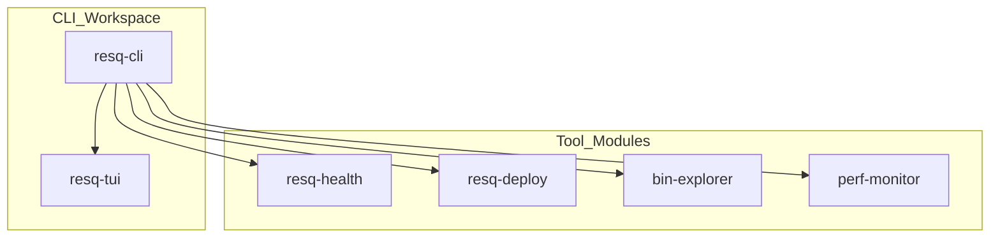

# resq-cli


A unified Rust-based CLI and TUI toolchain designed to streamline developer workflows for the ResQ autonomous drone platform. `resq-cli` consolidates auditing, security, performance monitoring, and deployment orchestration into a single, cohesive binary architecture.

---

## Overview

The `resq` ecosystem is a high-performance Rust monorepo. It distinguishes between the end-user CLI experience (the `resq` binary) and the internal library architecture (`resq-tui`) which powers consistent terminal interfaces across all tooling.



---

## Features

*   **Security First:** Integrated secret scanning and repository auditing.
*   **Performance Monitoring:** Real-time metrics and flame graph generation for polyglot services.
*   **Orchestration:** TUI-based Kubernetes and Docker Compose deployment management.
*   **Developer Productivity:** Automated copyright header enforcement, tree-shaking, and `.gitignore`-aware workspace cleaning.
*   **Unified TUI Library:** Shared component library (`resq-tui`) ensuring consistent UX across the entire toolchain.

---

## Architecture

`resq-cli` is architected as a workspace of modular binaries sharing a common UI core.

- **`resq-cli` (Entry Point):** The primary binary, utilizing `clap` v4 for command routing. It acts as a lightweight wrapper that dispatches to underlying module binaries.
- **`resq-tui` (Core Library):** A shared crate built on `ratatui`. It abstracts complex UI components (spinners, tables, headers, footers), ensuring all `resq-*` binaries maintain an identical UX.
- **Modular Binaries:** Tools like `resq-health`, `resq-deploy`, and `bin-explorer` function as standalone tools while remaining tightly coupled via shared workspace dependency management.

---

## Installation

### Prerequisites
- **Nix:** Recommended for reproducible development environments.
- **Rust:** Latest stable toolchain.

### Via Cargo
```sh
cargo install resq-cli
```

### From Source
```sh
git clone https://github.com/resq-software/cli.git
cd cli
cargo build --release --workspace
```

### Nix Troubleshooting
If you encounter environment issues within `nix develop`:
1. **Clean state:** Ensure no conflicting `CARGO_HOME` or `RUSTUP_HOME` variables are bleeding from your local shell into the Nix shell.
2. **Library Paths:** If native dependencies fail to link, run `nix-collect-garbage -d` followed by a re-entry into `nix develop`.
3. **Caching:** If builds are unexpectedly slow, ensure `~/.cache/nix` is accessible and not exceeding disk quotas.

---

## Quick Start

1. **Bootstrap local environment:**
   ```sh
   ./bootstrap.sh
   ```
2. **Run a security audit:**
   ```sh
   resq audit
   ```
3. **Clean build artifacts:**
   ```sh
   resq clean
   ```

---

## Usage

The `resq` binary acts as an orchestrator for all sub-tools.

### Security & Audit
- `resq audit`: Run full OSV/dependency security audit.
- `resq secrets`: Scan workspace for credentials.
- `resq pre-commit`: Run comprehensive pre-commit check (audit, headers, secrets).

### Deployment & Health
- `resq deploy --env prod --k8s`: Launch Kubernetes deployment TUI.
- `resq health`: Launch service health monitoring dashboard.
- `resq logs`: Aggregate and stream service logs.

### Maintenance & Analysis
- `resq asm --file ./path/to/binary`: Analyze binary machine code.
- `resq clean`: Run interactive workspace cleaner.
- `resq copyright`: Enforce Apache-2.0 license headers.

---

## Configuration

| Environment Variable | Description |
| :--- | :--- |
| `GIT_HOOKS_SKIP` | Disables automated pre-commit hooks. |
| `RESQ_NIX_RECURSION` | Internal safety flag for recursive execution in Nix environments. |

---

## Development

The project utilizes `Nix` to maintain consistency across team environments.

1. **Environment:** Enter the shell with `nix develop`.
2. **Testing:** Execute `cargo nextest run` for optimized parallel testing.
3. **Consistency:** Always keep `AGENTS.md` and `CLAUDE.md` in sync using `./agent-sync.sh`.

---

## Contributing

We strictly adhere to [Conventional Commits](https://www.conventionalcommits.org/).

1. **Branching:** Use `feat/`, `fix/`, or `refactor/` prefixes.
2. **Quality:** Run `cargo clippy --workspace -- -D warnings` before submitting.
3. **Automation:** Ensure all CI workflows (including `osv-scan`) pass.
4. **License Headers:** Run `resq copyright` to automatically update headers on all new source files.

---

## License

Copyright 2026 ResQ. Licensed under the [Apache License, Version 2.0](./LICENSE).