<!--
  Copyright 2026 ResQ

  Licensed under the Apache License, Version 2.0 (the "License");
  you may not use this file except in compliance with the License.
  You may obtain a copy of the License at

      http://www.apache.org/licenses/LICENSE-2.0

  Unless required by applicable law or agreed to in writing, software
  distributed under the License is distributed on an "AS IS" BASIS,
  WITHOUT WARRANTIES OR CONDITIONS OF ANY KIND, either express or implied.
  See the License for the specific language governing permissions and
  limitations under the License.
-->

# resq-cli

[](https://crates.io/crates/resq-cli)
[](LICENSE)

Unified developer CLI for the ResQ platform. Provides commands for license header management, security auditing, secret scanning, dependency cost analysis, image placeholder generation, documentation export, monorepo versioning, and launching a suite of interactive TUI tools.

## Overview

`resq` is the single entry point for all ResQ developer tooling. It wraps standalone TUI applications (logs, health, deploy, perf, clean, asm) and provides built-in commands for CI workflows, pre-commit hooks, and repository maintenance.

```mermaid
graph TD
    resq["resq (CLI)"]

    resq --> copyright["copyright"]
    resq --> lqip["lqip"]
    resq --> audit["audit"]
    resq --> cost["cost"]
    resq --> secrets["secrets"]
    resq --> tree_shake["tree-shake"]
    resq --> pre_commit["pre-commit"]

    resq --> dev["dev"]
    dev --> kill_ports["dev kill-ports"]
    dev --> sync_env["dev sync-env"]
    dev --> upgrade["dev upgrade"]
    dev --> install_hooks["dev install-hooks"]

    resq --> version["version"]
    version --> version_add["version add"]
    version --> version_apply["version apply"]
    version --> version_check["version check"]

    resq --> docs["docs"]

    resq --> explore["explore (resq-perf)"]
    resq --> clean["clean (resq-clean)"]
    resq --> asm["asm (resq-bin)"]

    style resq fill:#2563eb,color:#fff
    style dev fill:#7c3aed,color:#fff
    style version fill:#7c3aed,color:#fff
    style explore fill:#059669,color:#fff
    style logs fill:#059669,color:#fff
    style health fill:#059669,color:#fff
    style deploy fill:#059669,color:#fff
    style clean fill:#059669,color:#fff
    style asm fill:#059669,color:#fff
```



**Legend:** Blue = entry point, Purple = commands with subcommands, Green = TUI launchers.

## Installation

```bash
# Build from the workspace root
cargo build --release -p resq-cli

# Install globally
cargo install --path cli

# Or use the cargo alias (defined in .cargo/config.toml)
cargo resq help
```

The binary is installed as `resq` at `target/release/resq`.

### Cargo Aliases

The following workspace aliases are defined in `.cargo/config.toml`:

| Alias             | Maps to              |
| ----------------- | -------------------- |
| `cargo resq`      | `resq`               |
| `cargo health`    | `resq health`        |
| `cargo logs`      | `resq logs`          |
| `cargo perf`      | `resq explore`       |
| `cargo deploy`    | `resq deploy`        |
| `cargo cleanup`   | `resq clean`         |
| `cargo bin`       | `resq asm`           |
| `cargo check-all` | workspace check      |
| `cargo t`         | workspace test       |
| `cargo c`         | workspace clippy      |
| `cargo flame`     | `resq-flame` binary  |

---

## Commands

### `copyright` -- License Header Management

Adds or checks copyright/license headers across all source files in the repository. Supports multiple comment styles (C-style block, XML/HTML, hash-line, double-dash, Elisp, AsciiDoc). Shebangs (`#!/...`) are always preserved at line 0.

#### Arguments

| Flag / Option | Type | Default | Description |
| --- | --- | --- | --- |
| `-l, --license <LICENSE>` | `String` | `apache-2.0` | License type: `apache-2.0`, `mit`, `gpl-3.0`, `bsd-3-clause` |
| `-a, --author <AUTHOR>` | `String` | `ResQ` | Copyright holder name |
| `-y, --year <YEAR>` | `String` | current year | Copyright year |
| `--force` | `bool` | `false` | Overwrite existing headers |
| `--dry-run` | `bool` | `false` | Preview changes without writing files |
| `--check` | `bool` | `false` | CI mode -- exits non-zero if any headers are missing |
| `-v, --verbose` | `bool` | `false` | Print detailed processing info |
| `--glob <PATTERN>...` | `Vec<String>` | none | Glob patterns to match files (e.g. `src/**/*.rs`) |
| `--ext <EXT,...>` | `Vec<String>` | none | Comma-separated file extensions to include (e.g. `rs,js,py`) |
| `-e, --exclude <PATTERN>...` | `Vec<String>` | none | Patterns to exclude from processing |

#### Examples

```bash
# Check all tracked files (CI -- exits 1 if any missing)
resq copyright --check

# Preview what would be added without writing
resq copyright --dry-run

# Add headers to all files missing them
resq copyright

# Overwrite existing headers with a different license and author
resq copyright --force --license apache-2.0 --author "Acme Corp" --year 2026

# Process only Rust and TypeScript files
resq copyright --ext rs,ts

# Process files matching a glob pattern
resq copyright --glob "crates/**/*.rs"
```

---

### `lqip` -- Low-Quality Image Placeholders

Generates tiny base64-encoded data URIs from images for use as blur-up placeholders in web applications. Supports JPEG, PNG, and WebP formats.

#### Arguments

| Flag / Option | Type | Default | Description |
| --- | --- | --- | --- |
| `-t, --target <PATH>` | `String` | *required* | Directory or file to process |
| `--width <PX>` | `u32` | `20` | Width of the generated LQIP in pixels |
| `--height <PX>` | `u32` | `15` | Height of the generated LQIP in pixels |
| `-r, --recursive` | `bool` | `false` | Recursively search directories for images |
| `--format <FORMAT>` | `String` | `text` | Output format: `text` or `json` |

#### Examples

```bash
# Single image -- prints data URI
resq lqip --target hero.jpg

# Directory of images -- text list
resq lqip --target public/images/

# Recursive with JSON output
resq lqip --target public/ --recursive --format json

# Custom dimensions
resq lqip --target photo.png --width 32 --height 24
```

---

### `audit` -- Security & Quality Audit

Three-pass security and quality sweep covering all language ecosystems. Runs Google OSV Scanner (cross-ecosystem), npm audit-ci, and React Doctor.

#### Arguments

| Flag / Option | Type | Default | Description |
| --- | --- | --- | --- |
| `--root <DIR>` | `PathBuf` | `.` | Root directory to start search from |
| `--level <SEVERITY>` | `String` | `critical` | Minimum npm vulnerability severity to fail on (`critical`, `high`, `moderate`, `low`) |
| `--report-type <TYPE>` | `String` | `important` | audit-ci report verbosity (`important`, `full`, `summary`) |
| `--skip-prepare` | `bool` | `false` | Skip the yarn.lock generation step required by audit-ci |
| `--skip-npm` | `bool` | `false` | Skip the npm audit-ci pass |
| `--skip-osv` | `bool` | `false` | Skip the Google OSV Scanner pass |
| `--osv-format <FORMAT>` | `String` | `table` | OSV Scanner output format (`table`, `json`, `sarif`, `gh-annotations`) |
| `--skip-react` | `bool` | `false` | Skip the react-doctor pass |
| `--react-target <DIR>` | `PathBuf` | `<root>/services/web-dashboard` | Path to the React/Next.js project for react-doctor |
| `--react-diff <BRANCH>` | `String` | none | Only scan React files changed vs this base branch |
| `--react-min-score <N>` | `u8` | `75` | Minimum react-doctor health score to pass (0-100) |

#### Examples

```bash
# Full audit (all three passes)
resq audit

# Run only the OSV Scanner pass
resq audit --skip-npm --skip-react

# Strict npm audit (fail on moderate)
resq audit --skip-osv --skip-react --level moderate

# OSV Scanner with JSON output
resq audit --skip-npm --skip-react --osv-format json

# React Doctor with custom threshold and diff mode
resq audit --skip-osv --skip-npm --react-min-score 90 --react-diff main
```

---

### `cost` -- Dependency Size Analysis

Fetches package sizes from registries (npm, crates.io, PyPI) and categorizes dependencies by download footprint into high (>10 MB), medium (1-10 MB), and low (<1 MB) buckets. Results are saved as JSON files.

#### Arguments

| Flag / Option | Type | Default | Description |
| --- | --- | --- | --- |
| `--root <DIR>` | `PathBuf` | `.` | Root directory containing project manifest |
| `--output <DIR>` | `PathBuf` | `scripts/out` | Output directory for result JSON files |
| `--project-type <TYPE>` | `String` | auto-detected | Force a specific project type: `node`, `rust`, `python` |

#### Examples

```bash
# Auto-detect project type and analyze
resq cost

# Analyze a specific project directory
resq cost --root services/coordination-hce

# Force Rust analysis and custom output
resq cost --project-type rust --output reports/deps
```

---

### `secrets` -- Secret Scanner

Scans source files for hardcoded credentials, API keys, private keys, tokens, and high-entropy strings. Uses pattern matching with entropy analysis (Shannon entropy with charset-specific thresholds for hex, base64, and alphanumeric strings) and Aho-Corasick multi-pattern matching for performance.

#### Arguments

| Flag / Option | Type | Default | Description |
| --- | --- | --- | --- |
| `--root <DIR>` | `PathBuf` | `.` | Root directory to scan |
| `--git-only` | `bool` | `true` | Only scan git-tracked files |
| `-v, --verbose` | `bool` | `false` | Show verbose output (print matched content) |
| `--allowlist <FILE>` | `PathBuf` | none | Path to allowlist file (one pattern per line) |
| `--staged` | `bool` | `false` | Scan only staged git changes (for pre-commit hook) |
| `--history` | `bool` | `false` | Also scan git history (all commits reachable from HEAD) |
| `--since <REV>` | `String` | none | Limit history scan to commits after this rev/date (e.g. `"30 days ago"`, `"v1.0.0"`) |

#### Examples

```bash
# Scan all git-tracked files (default)
resq secrets

# Only scan staged changes (pre-commit hook)
resq secrets --staged

# Scan with history and allowlist
resq secrets --history --since "v1.0.0" --allowlist .secrets-allowlist

# Verbose output showing matched content
resq secrets --verbose
```

---

### `tree-shake` -- TypeScript Dead Code Removal

Runs [`tsr`](https://github.com/line/ts-remove-unused) to remove unused TypeScript exports from project entry points. Requires `bun` to be installed.

#### Arguments

This command takes no arguments.

#### Examples

```bash
resq tree-shake
```

---

### `dev` -- Development Utilities

Unified entry point for repository-level development tasks.

#### Subcommands

##### `dev kill-ports` -- Kill Processes on Ports

Finds and terminates processes listening on specified TCP ports.

| Flag / Option | Type | Default | Description |
| --- | --- | --- | --- |
| `<TARGETS>...` | `Vec<String>` | *required* | Ports or ranges (e.g. `8000` or `8000..8010`) |
| `-f, --force` | `bool` | `false` | Use SIGKILL instead of SIGTERM |
| `-y, --yes` | `bool` | `false` | Skip confirmation prompt |

```bash
# Kill process on port 3000
resq dev kill-ports 3000

# Kill range of ports without confirmation
resq dev kill-ports 8000..8010 --yes

# Force kill
resq dev kill-ports 3000 --force
```

##### `dev sync-env` -- Sync Environment Variables to turbo.json

Scans `.env.example` files across the monorepo and synchronizes discovered environment variable names into `turbo.json` task configurations.

| Flag / Option | Type | Default | Description |
| --- | --- | --- | --- |
| `-t, --tasks <LIST>` | `String` | `build,dev,start,test` | Comma-separated tasks to update in turbo.json |
| `-d, --dry-run` | `bool` | `false` | Preview changes without writing |
| `--max-depth <N>` | `usize` | `10` | Maximum directory depth to search |

```bash
# Sync all environment variables
resq dev sync-env

# Preview changes
resq dev sync-env --dry-run

# Sync only for build and dev tasks
resq dev sync-env --tasks build,dev
```

##### `dev upgrade` -- Upgrade Dependencies

Upgrades dependencies across all language silos in the monorepo (Python/uv, Rust/cargo, JS/bun, C++/Conan, C#/dotnet, Nix).

| Flag / Option | Type | Default | Description |
| --- | --- | --- | --- |
| `<SILO>` | `String` | `all` | Silo to upgrade: `python`, `rust`, `js`, `cpp`, `csharp`, `nix`, or `all` |

```bash
# Upgrade all ecosystems
resq dev upgrade

# Upgrade only Rust dependencies
resq dev upgrade rust

# Upgrade only JavaScript dependencies
resq dev upgrade js
```

##### `dev install-hooks` -- Install Git Hooks

Configures `git core.hooksPath` to point at the `.git-hooks` directory and makes all hook scripts executable.

```bash
resq dev install-hooks
```

---

### `pre-commit` -- Unified Pre-Commit Hook

Runs a suite of checks suitable for a git pre-commit hook: copyright headers, secret scanning, formatting, audits, and versioning prompts. Includes an interactive TUI progress display.

#### Arguments

| Flag / Option | Type | Default | Description |
| --- | --- | --- | --- |
| `--root <DIR>` | `PathBuf` | `.` | Project root (defaults to auto-detected) |
| `--skip-audit` | `bool` | `false` | Skip security audit (osv-scanner + npm audit-ci) |
| `--skip-format` | `bool` | `false` | Skip formatting step |
| `--skip-versioning` | `bool` | `false` | Skip changeset/versioning prompt |
| `--max-file-size <BYTES>` | `u64` | `10485760` (10 MiB) | Maximum file size in bytes |
| `--no-tui` | `bool` | `false` | Disable TUI (plain output for CI or piped stderr) |

#### Examples

```bash
# Run all pre-commit checks
resq pre-commit

# Skip audit and formatting (fast mode)
resq pre-commit --skip-audit --skip-format

# CI-friendly plain output
resq pre-commit --no-tui
```

---

### `version` -- Monorepo Versioning

Manages package versions and changesets across the monorepo using a changeset-based workflow. Supports Cargo.toml, package.json, pyproject.toml, and Directory.Build.props manifests.

#### Subcommands

##### `version add` -- Create a Changeset

| Flag / Option | Type | Default | Description |
| --- | --- | --- | --- |
| `-b, --bump <TYPE>` | `String` | `patch` | Type of change: `patch`, `minor`, `major` |
| `-m, --message <MSG>` | `String` | *required* | Summary of what changed |

```bash
resq version add --bump minor --message "Add new health check endpoint"
```

##### `version apply` -- Apply Version Bumps

Consumes all pending changesets, determines the highest bump level, updates all manifests, and appends to CHANGELOG.md.

| Flag / Option | Type | Default | Description |
| --- | --- | --- | --- |
| `--dry-run` | `bool` | `false` | Preview what would change without modifying files |

```bash
# Apply version bumps
resq version apply

# Preview only
resq version apply --dry-run
```

##### `version check` -- Verify Version Sync

Checks that all manifest files contain the same version string.

```bash
resq version check
```

---

### `docs` -- Documentation Export

Exports and publishes OpenAPI specifications from the Infrastructure API and Coordination HCE services.

#### Arguments

| Flag / Option | Type | Default | Description |
| --- | --- | --- | --- |
| `-e, --export-only` | `bool` | `false` | Only export specs locally without publishing |
| `-p, --publish` | `bool` | `false` | Publish specifications to the documentation repository via GitHub API |
| `--dry-run` | `bool` | `false` | Show what would be done without executing |

#### Examples

```bash
# Export specs locally
resq docs --export-only

# Export and publish to GitHub
resq docs --publish

# Preview what would happen
resq docs --dry-run
```

---

### TUI Launchers

These commands launch standalone TUI applications from the ResQ workspace. Each delegates to a separate binary via `cargo run -p <tool>`.

#### `explore` -- Performance Monitor (resq-perf)

| Flag / Option | Type | Default | Description |
| --- | --- | --- | --- |
| `<URL>` | `String` | `http://localhost:3000/admin/status` | Service URL to monitor |
| `--refresh-ms <MS>` | `u64` | `500` | Refresh rate in milliseconds |

```bash
resq explore
resq explore http://localhost:8080/status --refresh-ms 1000
```

#### `clean` -- Workspace Cleaner (resq-clean)

| Flag / Option | Type | Default | Description |
| --- | --- | --- | --- |
| `--dry-run` | `bool` | `false` | Preview what would be deleted without removing anything |

```bash
resq clean
resq clean --dry-run
```

#### `asm` -- Binary Analyzer (resq-bin)

| Flag / Option | Type | Default | Description |
| --- | --- | --- | --- |
| `--file <PATH>` | `String` | none | Analyze a single binary (conflicts with `--dir`) |
| `--dir <PATH>` | `String` | none | Analyze binaries under a directory (conflicts with `--file`) |
| `--recursive` | `bool` | `false` | Recursively traverse directory in batch mode |
| `--ext <SUFFIX>` | `String` | none | Suffix filter in batch mode (e.g. `.so`, `.o`) |
| `--config <PATH>` | `String` | none | Path to resq-bin config TOML |
| `--no-cache` | `bool` | `false` | Disable cache reads/writes |
| `--rebuild-cache` | `bool` | `false` | Force cache rebuild |
| `--no-disasm` | `bool` | `false` | Only collect metadata, skip disassembly |
| `--max-functions <N>` | `usize` | none | Maximum functions to disassemble per binary |
| `--tui` | `bool` | `false` | Force interactive TUI mode |
| `--plain` | `bool` | `false` | Use non-interactive plain output |
| `--json` | `bool` | `false` | Emit JSON report output |

```bash
resq asm --file target/release/resq
resq asm --dir target/release/ --recursive --ext .so
resq asm --file mylib.o --plain --no-cache
resq asm --dir . --recursive --json --max-functions 100
```

---

## Environment Variables

| Variable | Used By | Description |
| --- | --- | --- |
| `RUST_LOG` | all commands | Controls `tracing-subscriber` log level (e.g. `debug`, `info`, `warn`) |
| `GH_TOKEN` / `GITHUB_TOKEN` | `docs --publish` | GitHub API authentication for publishing specs |

The `pre-commit` and `audit` commands shell out to external tools (`osv-scanner`, `bun`, `npx`, `audit-ci`, `react-doctor`) which may read their own environment variables.

## Configuration

- **Project root detection**: The CLI walks up the directory tree looking for `resQ.sln`, `package.json`, `Cargo.toml`, `pyproject.toml`, or `.git` to locate the project root.
- **Gitignore integration**: The `secrets` and `copyright` commands parse `.gitignore` for directory exclusion. When `.gitignore` is missing, a built-in fallback list is used (`node_modules`, `.git`, `dist`, `build`, `.next`, `target`, `__pycache__`, `.venv`, `venv`, `vendor`, `.turbo`, `coverage`).
- **OSV Scanner config**: If `osv-scanner.toml` exists at the project root, it is passed automatically to the `audit` command.
- **Secrets allowlist**: Create a text file with one pattern per line and pass it via `--allowlist`.
- **Changesets**: Version changesets are stored as markdown files in `.changesets/` at the repository root.

## Exit Codes

| Code | Meaning |
| --- | --- |
| `0` | Success |
| `1` | Command failed (e.g. audit found vulnerabilities, copyright headers missing in `--check` mode, secrets detected, versions out of sync) |
| `2` | CLI argument parsing error |

## License

Licensed under the Apache License, Version 2.0. See [LICENSE](../../LICENSE) for the full text.
