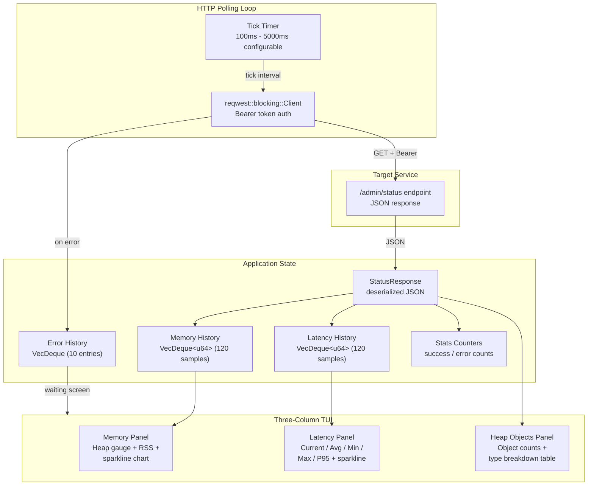

<!--
  Copyright 2026 ResQ

  Licensed under the Apache License, Version 2.0 (the "License");
  you may not use this file except in compliance with the License.
  You may obtain a copy of the License at

      http://www.apache.org/licenses/LICENSE-2.0

  Unless required by applicable law or agreed to in writing, software
  distributed under the License is distributed on an "AS IS" BASIS,
  WITHOUT WARRANTIES OR CONDITIONS OF ANY KIND, either express or implied.
  See the License for the specific language governing permissions and
  limitations under the License.
-->

# resq-perf

[](https://crates.io/crates/resq-perf)
[](LICENSE)

Real-time performance monitoring dashboard for ResQ services. Polls a service's `/status` endpoint and displays live memory usage, response latency, and heap object breakdowns in a three-column Ratatui TUI with sparkline history charts.

## Architecture



## Installation

```bash
# From workspace root
cargo build --release -p resq-perf

# Binary location
target/release/resq-perf
```

## CLI Arguments

| Argument / Flag | Type | Default | Description |
|----------------|------|---------|-------------|
| `url` (positional) | `String` | `http://localhost:3000/admin/status` | Service status endpoint URL to monitor |
| `--refresh-ms <ms>` | `u64` | `500` | Refresh interval in milliseconds (clamped to 100-5000) |
| `-t`, `--token <jwt>` | `String` | `$RESQ_TOKEN` | Bearer token for authenticated endpoints |

## Usage Examples

```bash
# Monitor default HCE service (localhost:3000)
resq-perf

# Target a specific service status URL
resq-perf http://localhost:5000/admin/status

# Authenticated service with explicit token
resq-perf --token <your-bearer-token>

# Use environment variable for authentication
export RESQ_TOKEN="<your-bearer-token>"
resq-perf http://localhost:3000/admin/status

# Slower refresh rate (1 second) for low-bandwidth environments
resq-perf --refresh-ms 1000

# Fast refresh for detailed monitoring
resq-perf --refresh-ms 100
```

## Metrics Reference

### Status Endpoint Schema

The tool expects JSON from the `/admin/status` endpoint matching this structure (compatible with `coordination-hce`):

```json
{
  "uptime": "2h 15m 30s",
  "uptimeNanoseconds": 8130000000000,
  "version": "1.2.3",
  "environment": "production",
  "memory": {
    "process": {
      "rss": 104857600,
      "heapUsed": 52428800,
      "heapTotal": 67108864,
      "external": 1048576,
      "arrayBuffers": 524288
    },
    "heap": {
      "heapSize": 67108864,
      "heapCapacity": 83886080,
      "extraMemorySize": 2097152,
      "objectCount": 45000,
      "protectedObjectCount": 1200,
      "globalObjectCount": 350,
      "protectedGlobalObjectCount": 50,
      "objectTypeCounts": {
        "Object": 15000,
        "Array": 8000,
        "Function": 5000,
        "String": 12000
      }
    }
  }
}
```

### Displayed Metrics

| Panel | Metric | Source Field | Description |
|-------|--------|-------------|-------------|
| Memory | Heap Gauge | `memory.process.heapUsed / heapTotal` | Percentage bar with color coding (green < 50%, yellow < 80%, red >= 80%) |
| Memory | RSS | `memory.process.rss` | Resident set size of the process |
| Memory | External | `memory.process.external` | Memory used by C++ objects bound to JS |
| Memory | Uptime | `uptimeNanoseconds` | Formatted as `Xh Xm Xs` |
| Memory | Version | `version` | Service version string |
| Memory | Sparkline | heap_used history | Rolling 120-sample chart of heap usage |
| Latency | Current | measured round-trip | Last HTTP request latency in ms |
| Latency | Average | computed | Mean of all samples in history |
| Latency | Min / Max | computed | Range across history window |
| Latency | P95 | computed | 95th percentile latency |
| Latency | Success Rate | success / total | Percentage of successful polls |
| Latency | Sparkline | latency history | Rolling 120-sample chart of response times |
| Heap Objects | Object Count | `memory.heap.objectCount` | Total objects on the V8 heap |
| Heap Objects | Protected | `memory.heap.protectedObjectCount` | GC-protected object count |
| Heap Objects | Global | `memory.heap.globalObjectCount` | Global scope object count |
| Heap Objects | Heap Size | `memory.heap.heapSize` | Current heap allocation |
| Heap Objects | Capacity | `memory.heap.heapCapacity` | Total heap capacity |
| Heap Objects | Type Table | `memory.heap.objectTypeCounts` | Top 12 object types sorted by count |

## Environment Variables

| Variable | Description |
|----------|-------------|
| `RESQ_TOKEN` | Bearer token for service authentication. Used when `--token` is not provided. |

## Keybindings

| Key | Action |
|-----|--------|
| `q` / `Esc` | Quit |
| `Ctrl+C` | Force quit |
| `p` | Pause / resume polling |
| `r` | Reset all history, counters, and error log |
| `+` / `=` | Increase refresh rate by 100ms (faster polling) |
| `-` / `_` | Decrease refresh rate by 100ms (slower polling) |
| `h` | Toggle help overlay panel |

## TUI Layout

```
+-- ResQ Performance Monitor -- STATUS -- LATENCY ------------+
|                                                              |
| +-- Memory --------+ +-- Response Time -+ +-- Heap Objects -+|
| | [=======   ] 70% | | Current: 45ms    | | Objects: 45000  ||
| | RSS: 100.0 MiB   | | Average: 52ms    | | Protected: 1200 ||
| | External: 1.0 MiB| | Min: 12ms        | | Global: 350     ||
| | Uptime: 2h 15m   | | Max: 350ms       | | Heap: 64.0 MiB  ||
| | Version: 1.2.3   | | P95: 120ms       | | Capacity: 80 MiB||
| |                   | | Success: 99.2%   | |                 ||
| | History (max: 64M)| |                   | | Type     Count %||
| | ......########    | | Latency (max:350)| | Object   15000  ||
| | ....##########    | | ..####..####..   | | String   12000  ||
| +-------------------+ +------------------+ | Array     8000  ||
|                                             | Function  5000  ||
|                                             +-----------------+|
+--------------------------------------------------------------+
| q quit  p pause  r reset  +/- speed  h help | S:142 E:1 500ms|
+--------------------------------------------------------------+
```

## Configuration

### Refresh Rate Bounds

The refresh interval is clamped to the range **100ms - 5000ms**. The `+` and `-` keys adjust in 100ms increments at runtime. The initial value is set via `--refresh-ms` (default: 500ms).

### History Depth

Both memory and latency sparklines retain the most recent **120 samples** (`MAX_HISTORY`). At the default 500ms refresh rate, this covers approximately 60 seconds of data. The error history retains the last **10 entries**.

### HTTP Client

The built-in `reqwest::blocking::Client` has a **5-second timeout** per request. Authentication uses the `Authorization: Bearer <token>` header when a token is provided via `--token` or `RESQ_TOKEN`.

### Latency Color Coding

Response time in the header is color-coded:
- **Green**: < 50ms
- **Yellow**: 50-200ms
- **Red**: > 200ms

## Related Tools

- [`resq-logs`](../resq-logs/README.md) -- Log aggregator and stream viewer
- [`resq-flame`](../resq-flame/README.md) -- CPU flame graph profiler
- [`resq-health`](../resq-health/README.md) -- Service health checker

For comprehensive profiling workflows see [`docs/PROFILING_FLAMEGRAPH_GUIDE.md`](../../docs/PROFILING_FLAMEGRAPH_GUIDE.md).

## License

Licensed under the Apache License, Version 2.0. See [LICENSE](../../LICENSE) for details.
