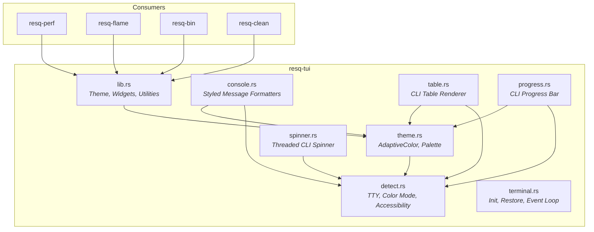
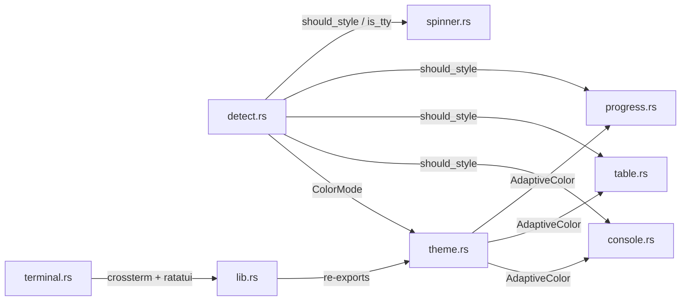

<!--
  Copyright 2026 ResQ

  Licensed under the Apache License, Version 2.0 (the "License");
  you may not use this file except in compliance with the License.
  You may obtain a copy of the License at

      http://www.apache.org/licenses/LICENSE-2.0

  Unless required by applicable law or agreed to in writing, software
  distributed under the License is distributed on an "AS IS" BASIS,
  WITHOUT WARRANTIES OR CONDITIONS OF ANY KIND, either express or implied.
  See the License for the specific language governing permissions and
  limitations under the License.
-->

# resq-tui

[](https://crates.io/crates/resq-tui)
[](LICENSE)

Shared TUI component library for all **ResQ** developer tools. Provides a unified theme system, console formatters, table rendering, progress bars, spinners, and terminal lifecycle management built on [Ratatui](https://ratatui.rs) and [Crossterm](https://docs.rs/crossterm).

## Overview

`resq-tui` ensures every ResQ tool (`resq-perf`, `resq-flame`, `resq-bin`, `resq-clean`, etc.) shares a consistent visual identity and interaction model. It provides two tiers of output:

- **Full-screen TUI** -- Ratatui-based widgets (header, footer, tabs, popups) with a standardized theme for interactive terminal applications.
- **Non-TUI CLI** -- Styled console formatters, tables, progress bars, and spinners for traditional command-line output that gracefully degrade when piped or redirected.

All styling is gated through environment detection so ANSI codes never bleed into pipes, redirects, or screen-reader environments.

## Architecture



### Module dependency flow



## Installation

Add to your `Cargo.toml`:

```toml
[dependencies]
resq-tui = { workspace = true }
```

Or from crates.io:

```toml
[dependencies]
resq-tui = "0.1.4"
```

## Module Reference

### `lib.rs` -- Core Widgets and Utilities

The root module re-exports `crossterm` and `ratatui` for convenience and provides the original `Theme` struct alongside shared TUI drawing functions.

#### `Theme` (root)

The original hardcoded dark-palette theme struct, retained for backward compatibility. For new code, prefer `theme::Theme::adaptive()` (see below).

| Field       | Type    | Default        | Description                   |
|-------------|---------|----------------|-------------------------------|
| `primary`   | `Color` | `Cyan`         | Primary brand color           |
| `secondary` | `Color` | `Blue`         | Secondary supporting color    |
| `accent`    | `Color` | `Magenta`      | Metadata accent               |
| `success`   | `Color` | `Green`        | Success state                 |
| `warning`   | `Color` | `Yellow`       | Warning / pending state       |
| `error`     | `Color` | `Red`          | Error / critical state        |
| `bg`        | `Color` | `Black`        | Background                    |
| `fg`        | `Color` | `White`        | Foreground text               |
| `highlight` | `Color` | `Rgb(50,50,50)`| Selection highlight           |
| `inactive`  | `Color` | `DarkGray`     | Muted / inactive elements     |

#### Widget Functions

##### `draw_header`

Renders a standardized header bar with service name, status badge, PID, and URL.

```rust
use resq_tui::{self as tui, Theme};

fn draw(f: &mut ratatui::Frame, area: ratatui::layout::Rect) {
    let theme = Theme::default();
    tui::draw_header(
        f,
        area,
        "My-Explorer",
        "READY",
        theme.success,
        Some(1234),              // PID (or None)
        "http://localhost:3000",
        &theme,
    );
}
```

**Signature:**
```rust
pub fn draw_header(
    frame: &mut Frame,
    area: Rect,
    title: &str,
    status: &str,
    status_color: Color,
    pid: Option<i32>,
    url: &str,
    theme: &Theme,
)
```

##### `draw_footer`

Renders a keyboard-shortcut footer bar.

```rust
tui::draw_footer(
    f,
    area,
    &[("Q", "Quit"), ("Tab", "Focus"), ("Up/Down", "Navigate")],
    &theme,
);
```

**Signature:**
```rust
pub fn draw_footer(frame: &mut Frame, area: Rect, keys: &[(&str, &str)], theme: &Theme)
```

##### `draw_tabs`

Renders a tab bar with selection highlight. Uses the default theme internally.

```rust
tui::draw_tabs(f, area, vec!["Overview", "Details", "Logs"], 0);
```

**Signature:**
```rust
pub fn draw_tabs(frame: &mut Frame, area: Rect, titles: Vec<&str>, selected: usize)
```

##### `draw_popup`

Renders a centered modal overlay for help dialogs or error messages.

```rust
use ratatui::text::Line;

tui::draw_popup(
    f,
    area,
    "Help",
    &[Line::raw("Press Q to quit"), Line::raw("Press ? for help")],
    60,  // percent_x
    40,  // percent_y
    &theme,
);
```

**Signature:**
```rust
pub fn draw_popup(
    frame: &mut Frame,
    area: Rect,
    title: &str,
    lines: &[Line],
    percent_x: u16,
    percent_y: u16,
    theme: &Theme,
)
```

##### `centered_rect`

Helper that computes a centered `Rect` given percentage dimensions. Used internally by `draw_popup`.

```rust
let popup_area = tui::centered_rect(60, 40, area);
```

#### Utility Functions

##### `format_bytes`

Converts a byte count to a human-readable string using binary units (KiB, MiB, GiB).

```rust
use resq_tui::format_bytes;

assert_eq!(format_bytes(0),           "0 B");
assert_eq!(format_bytes(1024),        "1.0 KiB");
assert_eq!(format_bytes(5242880),     "5.0 MiB");
assert_eq!(format_bytes(1073741824),  "1.00 GiB");
```

##### `format_duration`

Converts seconds to a human-readable duration string.

```rust
use resq_tui::format_duration;

assert_eq!(format_duration(45),    "45s");
assert_eq!(format_duration(125),   "2m 5s");
assert_eq!(format_duration(3661),  "1h 1m 1s");
assert_eq!(format_duration(90061), "1d 1h 1m");
```

##### `SPINNER_FRAMES`

Braille animation frames for TUI spinner widgets:

```rust
pub const SPINNER_FRAMES: &[&str] = &["⠋", "⠙", "⠹", "⠸", "⠼", "⠴", "⠦", "⠧", "⠇", "⠏"];
```

---

### `theme` -- Adaptive Color System

The theme module provides a Dracula-inspired adaptive color palette that switches between light and dark variants based on terminal environment detection.

#### `AdaptiveColor`

A color pair with `light` and `dark` variants that resolves at runtime via `detect_color_mode()`.

```rust
use resq_tui::theme::{AdaptiveColor, COLOR_PRIMARY};
use ratatui::style::Color;

let resolved: Color = COLOR_PRIMARY.resolve();
```

| Method      | Returns | Description                                      |
|-------------|---------|--------------------------------------------------|
| `resolve()` | `Color` | Returns the appropriate variant for the terminal |

#### Palette Constants

| Constant               | Dark (Dracula)          | Light                   | Usage                   |
|------------------------|-------------------------|-------------------------|-------------------------|
| `COLOR_PRIMARY`        | `Rgb(139, 233, 253)`   | `Rgb(0, 139, 139)`     | Brand / primary accent  |
| `COLOR_SECONDARY`      | `Rgb(189, 147, 249)`   | `Rgb(68, 71, 144)`     | Supporting elements     |
| `COLOR_ACCENT`         | `Rgb(255, 121, 198)`   | `Rgb(163, 55, 136)`    | Metadata / PID          |
| `COLOR_SUCCESS`        | `Rgb(80, 250, 123)`    | `Rgb(40, 130, 40)`     | Success states          |
| `COLOR_WARNING`        | `Rgb(241, 250, 140)`   | `Rgb(180, 120, 0)`     | Warning states          |
| `COLOR_ERROR`          | `Rgb(255, 85, 85)`     | `Rgb(215, 55, 55)`     | Error states            |
| `COLOR_FG`             | `Rgb(248, 248, 242)`   | `Rgb(40, 42, 54)`      | Foreground text         |
| `COLOR_BG`             | `Rgb(40, 42, 54)`      | `Rgb(248, 248, 242)`   | Background              |
| `COLOR_INACTIVE`       | `Rgb(98, 114, 164)`    | `Rgb(140, 140, 140)`   | Muted / comments        |
| `COLOR_HIGHLIGHT`      | `Rgb(68, 71, 90)`      | `Rgb(230, 230, 230)`   | Selection background    |
| `COLOR_PROGRESS_START` | `Rgb(189, 147, 249)`   | `Rgb(100, 60, 180)`    | Progress bar fill start |
| `COLOR_PROGRESS_END`   | `Rgb(139, 233, 253)`   | `Rgb(0, 139, 139)`     | Progress bar fill end   |
| `COLOR_PROGRESS_EMPTY` | `Rgb(98, 114, 164)`    | `Rgb(200, 200, 200)`   | Progress bar empty      |

#### `Theme` (theme module)

Extended theme struct with adaptive color support.

| Constructor     | Description                                                       |
|-----------------|-------------------------------------------------------------------|
| `Theme::adaptive()` | Resolves all colors via `AdaptiveColor::resolve()` (recommended) |
| `Theme::default()`  | Hardcoded dark palette for backward compatibility                |

```rust
use resq_tui::theme::Theme;

// Recommended: adapts to terminal background
let theme = Theme::adaptive();

// Legacy: always dark
let theme = Theme::default();
```

---

### `detect` -- Terminal Environment Detection

Detects TTY status, color support, and accessibility mode. All detection is cached per-process via `OnceLock`.

#### Environment Variables

| Variable     | Effect when set                                  |
|--------------|--------------------------------------------------|
| `NO_COLOR`   | Disables all ANSI styling ([no-color.org](https://no-color.org)) |
| `TERM=dumb`  | Disables all ANSI styling                        |
| `ACCESSIBLE` | Enables screen-reader / accessible mode          |
| `COLORFGBG`  | Used to detect light vs dark terminal background |

#### `ColorMode`

```rust
pub enum ColorMode {
    Dark,   // Dark terminal background (default assumption)
    Light,  // Light terminal background
    None,   // No color support
}
```

#### Public Functions

| Function              | Returns     | Description                                            |
|-----------------------|-------------|--------------------------------------------------------|
| `is_tty_stdout()`    | `bool`      | Whether stdout is a TTY                                |
| `is_tty_stderr()`    | `bool`      | Whether stderr is a TTY                                |
| `is_accessible_mode()`| `bool`     | Whether accessible / plain output is requested         |
| `should_style()`     | `bool`      | Master gate -- all console formatters check this       |
| `detect_color_mode()`| `ColorMode` | Resolved color mode for adaptive color selection       |

---

### `console` -- Styled Message Formatters

TTY-gated console formatters for non-TUI CLI output. Diagnostics go to stderr, structured data to stdout. All styling respects `detect::should_style()`.

#### Format Functions (return `String`)

| Function                  | Prefix | Color     | Usage                        |
|---------------------------|--------|-----------|------------------------------|
| `format_success(msg)`     | `✅`   | Success   | Completion messages          |
| `format_error(msg)`       | `❌`   | Error     | Error messages (bold)        |
| `format_warning(msg)`     | `⚠️`   | Warning   | Warning messages             |
| `format_info(msg)`        | `ℹ️`   | Primary   | Informational messages       |
| `format_command(cmd)`     | `▶`    | Secondary | Command references (bold)    |
| `format_progress(msg)`    | `⏳`   | Warning   | In-flight operations         |
| `format_prompt(msg)`      | `?`    | Primary   | Interactive prompts (bold)   |
| `format_verbose(msg)`     | --     | Dim       | Debug / verbose output       |
| `format_list_item(msg)`   | `  •`  | --        | Indented list items          |
| `format_section_header(h)`| `━━━`  | Primary   | Section dividers with rule   |
| `format_count(msg)`       | `📊`   | Accent    | Metrics / counts             |
| `format_location(msg)`    | `📁`   | Secondary | File paths / locations       |
| `format_list_header(h)`   | --     | FG (bold) | List / section headers       |
| `format_search(msg)`      | `🔍`   | Primary   | Search / scan operations     |

#### Print Functions (write to stderr)

Convenience wrappers that call the corresponding `format_*` function and print to stderr:

```rust
use resq_tui::console;

console::success("Deployment complete");
console::error("Connection refused");
console::warning("Certificate expires soon");
console::info("Scanning 42 services");
console::progress("Uploading artifacts...");
console::verbose("Retry attempt 3/5");
console::section("Results");
```

---

### `table` -- CLI Table Renderer

Renders styled tables to stderr with zebra-striped rows, auto-computed column widths, and adaptive colors. Falls back to plain aligned text when styling is disabled.

#### `Align`

```rust
pub enum Align {
    Left,   // Default alignment
    Right,  // Right-aligned (for numeric columns)
}
```

#### `Column`

Builder for table column definitions.

| Method                | Description                           |
|-----------------------|---------------------------------------|
| `Column::new(header)` | Left-aligned column                  |
| `Column::right(header)`| Right-aligned column                |
| `.width(w)`           | Sets minimum column width             |

#### `render_table`

Renders a complete table to stderr.

```rust
use resq_tui::table::{Column, render_table};

let columns = vec![
    Column::new("Service"),
    Column::right("Latency"),
    Column::new("Status").width(10),
];

let rows = vec![
    vec!["api".into(), "12ms".into(), "healthy".into()],
    vec!["worker".into(), "340ms".into(), "degraded".into()],
    vec!["cache".into(), "2ms".into(), "healthy".into()],
];

render_table(&columns, &rows);
```

Output (styled):
```
  Service  Latency  Status
  ───────  ───────  ──────────
  api         12ms  healthy
  worker     340ms  degraded     ← dimmed (zebra stripe)
  cache        2ms  healthy
```

---

### `progress` -- CLI Progress Bar

Non-TUI progress bar rendered to stderr with adaptive gradient colors. Falls back to plain ASCII in non-TTY mode.

#### `ProgressBar`

| Method                         | Description                                       |
|--------------------------------|---------------------------------------------------|
| `ProgressBar::new(msg, width)` | Creates a progress bar with message and width     |
| `.render(fraction)`            | Renders at the given fraction (0.0 to 1.0)        |
| `.finish()`                    | Ends the bar with a newline                       |
| `.finish_with_message(msg)`    | Clears the bar and prints a final message         |

```rust
use resq_tui::progress::ProgressBar;

let pb = ProgressBar::new("Downloading", 40);
for i in 0..=100 {
    pb.render(i as f64 / 100.0);
}
pb.finish_with_message("✅ Download complete");
```

TTY output: `Downloading ████████████████░░░░░░░░░░░░░░░░░░░░░░░░  40%`

Non-TTY output: `Downloading [################------------------------] 40%`

---

### `spinner` -- Threaded CLI Spinner

Thread-safe stderr spinner that respects TTY and accessibility settings. Uses braille animation by default with a plain-dots fallback.

#### `SPINNER_FRAMES`

Braille frames used by both the TUI spinner constant and the non-TUI `Spinner`:

```rust
pub const SPINNER_FRAMES: &[&str] = &["⠋", "⠙", "⠹", "⠸", "⠼", "⠴", "⠦", "⠧", "⠇", "⠏"];
```

#### `Spinner`

| Method                        | Description                                     |
|-------------------------------|-------------------------------------------------|
| `Spinner::start(msg)`        | Starts the spinner in a background thread       |
| `.stop_with_message(msg)`    | Stops and prints a final message                |
| `.stop()`                    | Stops without a final message                   |

The spinner is also stopped automatically on `Drop`.

```rust
use resq_tui::spinner::Spinner;

let spinner = Spinner::start("Fetching service health");
// ... long-running operation ...
spinner.stop_with_message("✅ Health check complete");
```

In non-TTY mode, `start()` prints `"Fetching service health..."` once and returns immediately.

---

### `terminal` -- Terminal Lifecycle Management

Manages raw mode, alternate screen, and provides a standard event loop for Ratatui applications.

#### Type Alias

```rust
pub type Term = Terminal<CrosstermBackend<io::Stdout>>;
```

#### `init() -> anyhow::Result<Term>`

Enables raw mode, enters the alternate screen, and returns an initialized `Term`.

#### `restore()`

Leaves the alternate screen and disables raw mode. Safe to call even in a partially-initialized state.

#### `TuiApp` Trait

Implement this trait on your application state to use `run_loop`.

```rust
pub trait TuiApp {
    fn draw(&mut self, frame: &mut ratatui::Frame);
    fn handle_key(&mut self, key: crossterm::event::KeyEvent) -> anyhow::Result<bool>;
}
```

Return `false` from `handle_key` to exit the event loop. `Ctrl+C` always exits.

#### `run_loop`

Runs a standard TUI event loop. `poll_ms` controls input polling frequency.

```rust
pub fn run_loop(
    terminal: &mut Term,
    poll_ms: u64,
    app: &mut dyn TuiApp,
) -> anyhow::Result<()>
```

---

## Integration Guide

### Building a new ResQ TUI tool

1. **Add the dependency** to your crate's `Cargo.toml`:

```toml
[dependencies]
resq-tui = { workspace = true }
```

2. **Implement `TuiApp`** on your application state:

```rust
use resq_tui::terminal::TuiApp;
use resq_tui::theme::Theme;
use resq_tui::{draw_header, draw_footer};
use ratatui::layout::{Constraint, Layout};

struct MyApp {
    theme: Theme,
}

impl TuiApp for MyApp {
    fn draw(&mut self, frame: &mut ratatui::Frame) {
        let area = frame.area();
        let chunks = Layout::vertical([
            Constraint::Length(3),  // header
            Constraint::Min(1),    // body
            Constraint::Length(3), // footer
        ])
        .split(area);

        draw_header(
            frame, chunks[0],
            "My-Tool", "RUNNING", self.theme.success,
            None, "localhost:8080", &self.theme,
        );

        // ... render your body content in chunks[1] ...

        draw_footer(
            frame, chunks[2],
            &[("Q", "Quit"), ("Tab", "Switch"), ("?", "Help")],
            &self.theme,
        );
    }

    fn handle_key(
        &mut self,
        key: crossterm::event::KeyEvent,
    ) -> anyhow::Result<bool> {
        use crossterm::event::KeyCode;
        match key.code {
            KeyCode::Char('q') => Ok(false),
            _ => Ok(true),
        }
    }
}
```

3. **Run the event loop** in `main`:

```rust
fn main() -> anyhow::Result<()> {
    let mut terminal = resq_tui::terminal::init()?;
    let mut app = MyApp {
        theme: Theme::adaptive(),
    };

    let result = resq_tui::terminal::run_loop(&mut terminal, 100, &mut app);
    resq_tui::terminal::restore();
    result
}
```

### Using non-TUI console output

For CLI tools that do not need a full-screen TUI:

```rust
use resq_tui::console;
use resq_tui::table::{Column, render_table};
use resq_tui::progress::ProgressBar;
use resq_tui::spinner::Spinner;

fn main() {
    console::section("Service Health");

    let spinner = Spinner::start("Checking services");
    // ... check services ...
    spinner.stop_with_message("✅ All services checked");

    let columns = vec![
        Column::new("Service"),
        Column::right("Latency"),
        Column::new("Status"),
    ];
    let rows = vec![
        vec!["api".into(), "12ms".into(), "healthy".into()],
    ];
    render_table(&columns, &rows);

    let pb = ProgressBar::new("Deploying", 30);
    for i in 0..=100 {
        pb.render(i as f64 / 100.0);
    }
    pb.finish_with_message(&console::format_success("Deployed"));
}
```

## Accessibility

`resq-tui` respects the following standards:

- **`NO_COLOR`** ([no-color.org](https://no-color.org)) -- disables all ANSI color codes
- **`TERM=dumb`** -- plain text output only
- **`ACCESSIBLE`** -- activates screen-reader-friendly output (plain dot spinners, no animation)
- Non-TTY pipes and redirects receive unstyled output automatically

## License

Licensed under the Apache License, Version 2.0. See [LICENSE](../LICENSE) for details.
